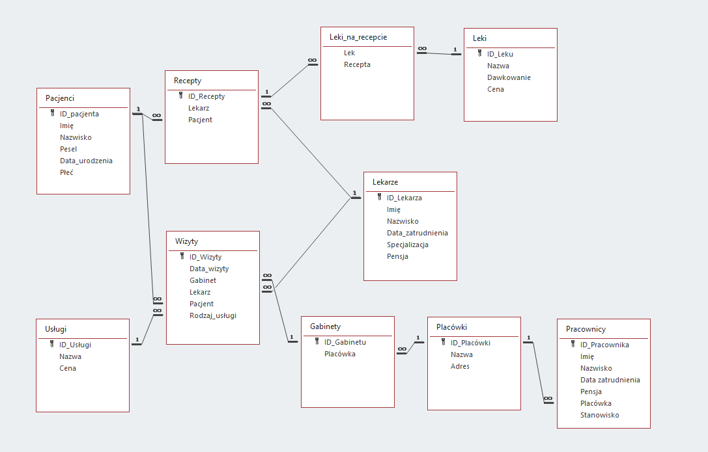

# Program do obsługi przychodni - **_Medcomplexsoft_**

## Wymagania
Celem projektu jest stworzenie aplikacji usprawniającej zarządzanie przychodnią przez możliwość umawiania wizyt oraz przechowywania danych o lekarzach i pacjentach.

## Opis działania:
Aplikacja będzie typu desktopowego, składająca się z kilku modułów dostępnych dla pracowników w zależności od ich stanowiska. \

Funkcje aplikacji:
* Umawianie wizyt
* Wystawianie recept i skierowań
* Historię leczenia pacjenta
* Zarządzanie wyposażeniem i zasobami przychodni
* Obsługa płatności za zrealizowane usługi
* Przechowywanie danych o pracownikach

## Opis planowanego środowiska i narzędzi:
Naszą aplikację planujemy stworzyć używając języka Java oraz Swinga, zaś do przechowywania danych użyjemy bazy danych Oracle.

#### Poglądowy schemat struktury bazy danych:

